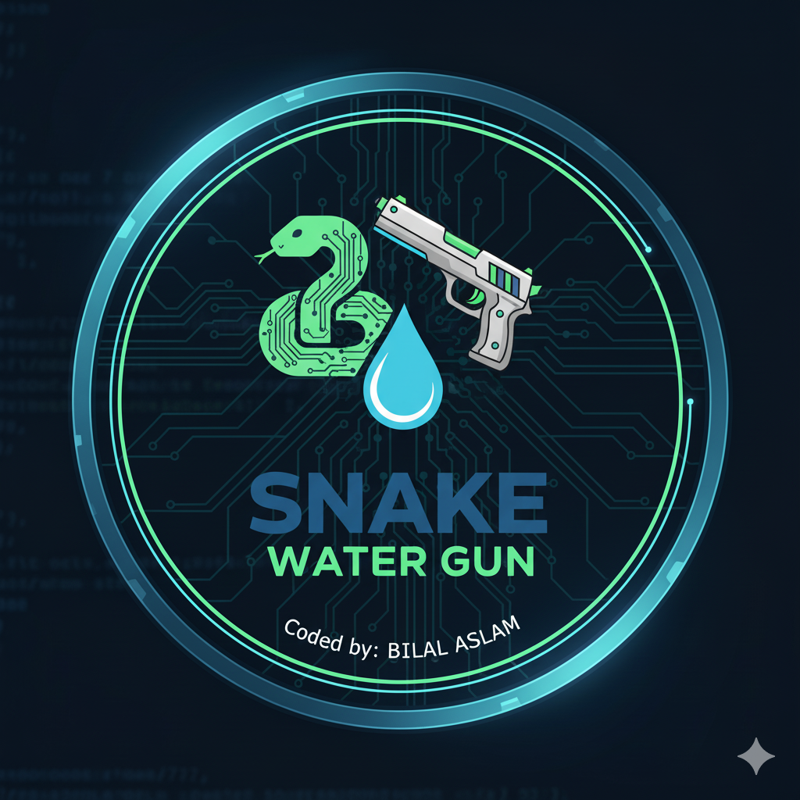

<p align="center">
  
</p>

<h1 align="center">Snake Water Gun Game</h1>

<p align="center">
  
  
  
  
</p>

---

## Overview

A beginner-friendly Python command-line game based on the classic Snake, Water, Gun rules. The player chooses one option, the computer randomly chooses another, and the game decides the result.

This project is a clean practice exercise for dictionaries, tuples, conditionals, input handling, and simple game logic.

---

## Rules

| Choice | Beats |
|---|---|
| Snake | Water |
| Water | Gun |
| Gun | Snake |

If both choices are the same, the match is a draw.

---

## How To Play

| Input | Choice |
|---|---|
| `s` | Snake |
| `w` | Water |
| `g` | Gun |

---

## Project Structure

```text
Snake-water-gun-Game/
|-- Snake-water-gun.py
|-- logo.png
|-- LICENSE
`-- README.md
```

---

## How To Run

```bash
git clone https://github.com/bilal-dev-0x/Snake-water-gun-Game.git
cd Snake-water-gun-Game
python Snake-water-gun.py
```

---

## Example Output

```text
Snake Water Gun Game
Choose one: s for snake, w for water, g for gun
Enter your choice: s
Computer chose: water
You chose: snake
Snake beats water.
You win!
```

---

## Concepts Practiced

- `random.choice()`
- Dictionaries
- Tuples
- Conditional logic
- User input handling
- Simple rule-based game design

---

## Future Improvements

- Add best-of-3 rounds.
- Add score tracking.
- Add replay without restarting.
- Add a small GUI version.

---

<p align="center">
  <b>A compact Python logic game with clean rules and simple command-line gameplay.</b>
</p>
